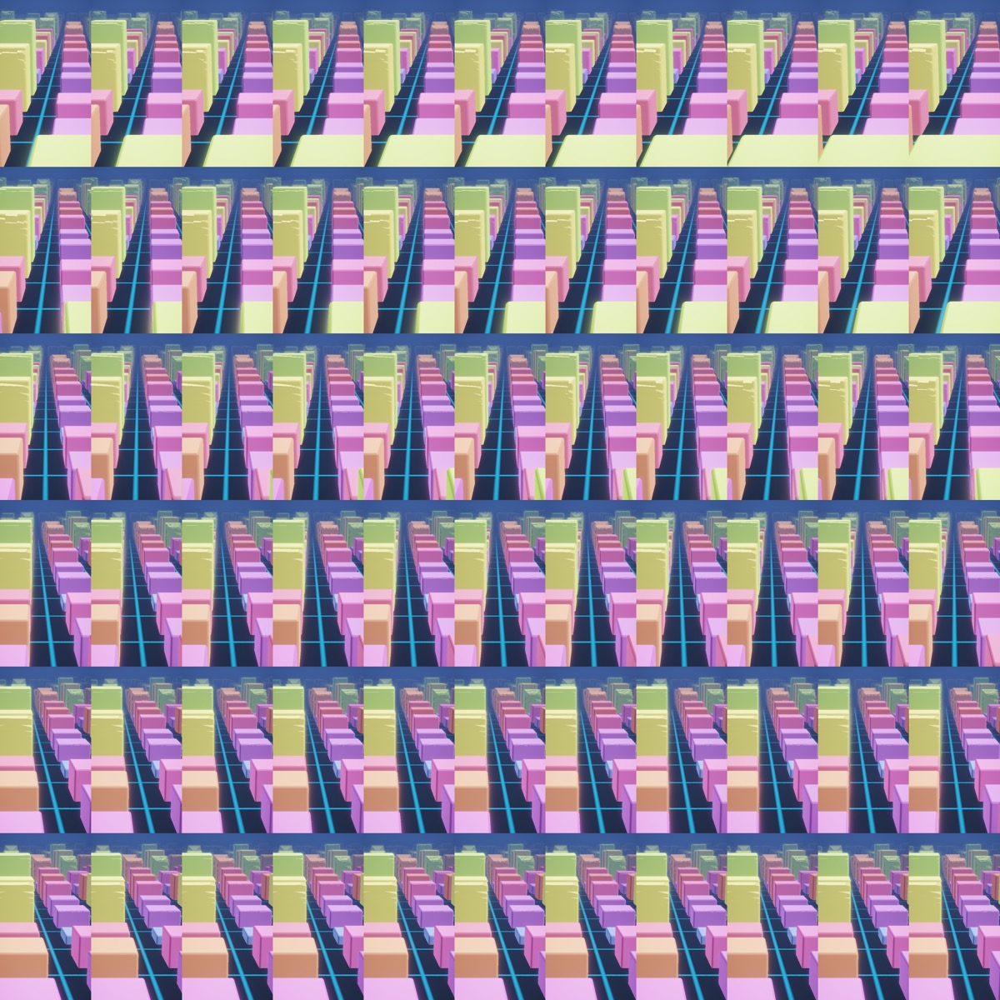
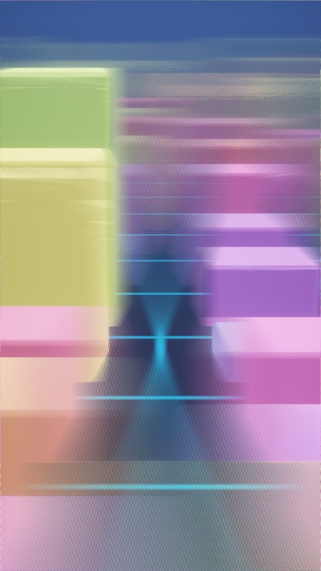

# lkg-metal-quilt

Real-time quilt rendering for Looking Glass light field displays, in pure Swift + Metal.

Renders an animated scene into a multi-view quilt every frame, interlaces it with the
device's factory optical calibration, and displays it fullscreen on the panel —
no Unity, no web stack, ~60 FPS on Apple Silicon.

| Quilt (66 views, 11x6) | Interlaced panel image |
|---|---|
|  |  |

Verified on Looking Glass Go (LKG-E10707) + Apple M5 Max @ 60 FPS, GPU ~9.5 ms/frame
at full 4092x4092 quilt resolution.

## How it works

1. **Quilt render** — the scene renders all views into one large quilt texture
   (e.g. 4092x4092 = 11x6 tiles of 372x682). View 0 is the bottom-left tile.
   The included demo is a raymarched shadertoy-style scene: a single fullscreen
   triangle where each fragment resolves its tile via `lkgTileInfo()` and casts
   a view ray from a parallel off-axis camera. Rasterized (mesh) content can use
   `QuiltCamera`'s per-view off-axis projection matrices instead.
2. **Lenticular interlace** — a post-process shader (ported from the official
   holoplay.js `QUILT_FRAGMENT_SHADER`) samples the quilt per RGB subpixel using
   the display's unique calibration (pitch / slope / center / DPI), producing the
   image the lenticular lens array turns into 3D.
3. **Calibration** — fetched live from a running
   [Looking Glass Bridge](https://lookingglassfactory.com/software) via its REST
   API (`PUT http://localhost:33334/...`). Falls back to built-in values for one
   specific LKG Go unit when Bridge is unavailable.

## Requirements

- macOS on Apple Silicon (tested on M5 Max, macOS 26/27)
- Swift toolchain — Command Line Tools is enough (shaders are compiled at
  runtime; no Xcode needed)
- A Looking Glass display connected as a screen
- [Looking Glass Bridge](https://lookingglassfactory.com/software) running
  (for exact per-device calibration; optional but recommended)

## Run the demo

```sh
swift run -c release lkg-demo                 # live: fullscreen on LKG + preview window
swift run -c release lkg-demo -- --no-preview # device only
```

Keys (focus the preview window first):

| Key | Action |
|---|---|
| `q` | quit |
| `s` / `S` | save quilt PNG / interlaced PNG to current directory |
| `f` | flip parallax direction (if the image looks inside-out) |
| `-` `=` | camera sweep (parallax amount) |
| `[` `]` | camera distance |
| `9` `0` | field of view |
| `1` / `2` | full / half resolution quilt render |
| `p` | pause animation |
| `b` | bypass interlace (show raw quilt on device, for debugging) |
| `c` | calibration test pattern — flat hue per view; on the device the panel should show one uniform color that sweeps hue as you move your head |

Offline frame export:

```sh
swift run -c release lkg-demo -- --dump quilt_qs11x6a0.56.png --time 1.2
swift run -c release lkg-demo -- --dump-lentic lenticular.png
```

Quilt PNGs follow the QuiltPlayer naming convention and can be opened in
QuiltPlayer / Looking Glass Studio directly.

## Use as a library (SwiftPM)

```swift
// Package.swift
.package(url: "https://github.com/Jup33Q/lkg-metal-quilt.git", from: "0.1.0")
```

```swift
import LKGQuilt

let app = try LKGApp(spec: .lkgGo)        // finds the LKG screen, fetches calibration
app.onRenderQuilt = { cmd, pass, time in
    // encode your scene into the quilt pass here
}
app.onKey = { key in false }              // custom keys
app.onStatusLine = { "my params" }        // extra text in the FPS log line
app.run()
```

### Writing your own raymarched scene

Prepend `LKGShaderCommon.msl` to your fragment shader source; it provides:

- `lkgTileInfo(px, tileSize, cols, rows)` — which view this fragment belongs to
  (view index, 0..1 sweep position, per-tile UV/NDC)
- `lkgViewOffset(viewT, sweep, flip)` — camera offset for the view
- `lkgViewRay(tileInfo, offset, dist, fovTan, tileAspect, pitch)` — off-axis
  camera ray (focus plane at z = 0)

Then render one fullscreen triangle into `renderer.makeQuiltPassDescriptor()`
with an `rgba16Float` target. See `Sources/lkg-demo/BlockCityScene.swift` for a
complete example.

### Lower-level API

- `QuiltSpec` — quilt grid layout (`.lkgGo`, `.lkgPortrait`, custom)
- `Calibration.fetchFromBridge()` — live device calibration via Bridge REST API
- `Calibration.lenticularUniforms(columns:rows:)` — interlace shader uniforms
- `QuiltRenderer` — quilt target + tonemap/interlace/test-pattern passes,
  `saveQuiltPNG` / `saveLenticularPNG` offline export
- `QuiltCamera` / `Matrix4x4` — off-axis projection math for mesh content
- `LKGApp.findLKGScreen()` — locate the LKG display

## Performance notes

Measured on Apple M5 Max, Looking Glass Go, full 4092x4092 quilt:

| Stage | GPU time |
|---|---|
| Scene raymarch (66 views, demo content) | ~9 ms |
| Lenticular interlace (1440x2560) | sub-ms (dwarfs under vsync pacing) |
| Total frame rate | 60 FPS (vsync-locked) |

The interlace pass reads the full quilt texture with scattered tile access;
keep the quilt as rgba16Float in private storage and avoid extra copies.

## AI demo: StreamDiffusion-stylized quilt (lkg-ai-demo)

Raymarched views are piped through StreamDiffusion (CoreML img2img) per view and
composited back into the quilt — an AI-stylized hologram, live.

```
Metal raymarch (per view, square staging) -> Python worker pool (CoreML SDXS img2img,
ANE + GPU hetero split) -> per-tile composite into persistent quilt -> interlace 60 Hz
```

Measured on M5 Max, 7x8=56-view layout (quilt 2016x4096), 2 workers, 384px:
**display 60 FPS locked; ~77 tiles/s; every view refreshes ~1.4 Hz on average**
(full sweep ~0.7 s). Event-driven: a finished worker immediately triggers the next
view render + dispatch, so AI throughput does not depend on the display link.

### Setup

```sh
# 1. CoreML models (one-time, offline from a local HF snapshot):
python3 scripts/convert_unet_coreml.py --snapshot <IDKiro/sdxs-512-0.9 snapshot dir> \
    --hidden-size 1024 --size 512 --output models/unet_sdxs_512.mlpackage
#    (repeat with --size 384 -> unet_sdxs_384.mlpackage; TAESD 384/512 enc/dec are
#     auto-converted on first run by the streamdiffusion-mac pipeline)

# 2. Python env: reuse the streamdiffusion-mac venv (coremltools/torch/diffusers),
#    passed via --python (default ~/Documents/kimi/workspace/streamdiffusion-mac/.venv/bin/python)
```

### Run

```sh
swift run -c release lkg-ai-demo                                   # live: 2 workers, 384px, 7x8
swift run -c release lkg-ai-demo -- --workers 3 --render-size 512  # beefier
swift run -c release lkg-ai-demo -- --dump ai-quilt.png            # offline quilt PNG
swift run -c release lkg-ai-demo -- --prompt "watercolor painting" # custom style
```

Flags: `--workers N` · `--render-size 320/384/512` · `--strength 0-1` ·
`--grid 7x8|11x6` · `--units all,cpu_and_gpu` (per-worker compute units; hetero
ANE+GPU is the measured optimum) · `--batch N` (batched UNet, needs
`unet_*_bN.mlpackage` — measured slower than per-view, kept for reference) ·
`--prompt/--python/--script/--models`.

Anti-flicker knobs (defaults are the tuned values): `--feedback 0.3` (per-view
latent temporal glue) · `--luma-norm 1.0` (AI tile mean brightness pulled to its
input frame's mean) · `--order wave|center` (serpentine scan-wave vs center-out
update order) · `--no-beat-epoch` (disable beat-aligned refresh epochs) ·
`--alt-mix 0-1` (permanent blend floor of the raw raymarch layer under the AI
quilt; hold `G` to smoothly fade to the raw layer and back — the interlace
shader lerps both quilts per subpixel at identical view coordinates) ·
`--beat-glow 0.25` (display-level beat pulse on the AI layer only — the
interlace scales the main quilt by `1 + beatGlow*beatPulse`, driven by the same
beat clock as the scene uniforms, so the whole AI layer breathes in sync).

The main quilt is a persistent AI composite: the raymarch base primes it once
at startup and never wipes it again (a periodic full-quilt `dontCare` pass
hard-cuts every tile ~10 times a second — measured worse than tile pop-in).
The live raw layer lives in the alt quilt and shows through via `--alt-mix`.

Status line reads per-tile refresh: `tile 1.38 Hz avg` = mean per-view update
rate (`tiles/s ÷ viewCount`) — the metric that matters for the rolling-update
quilt, since the display itself always runs at 60 Hz.

### Audio-reactive (Apple Music linkage)

Apple Music's PCM is DRM-protected — MusicKit cannot hand us audio buffers. Instead:

- **`MusicBridge`** (default, `--audio-source music`): reads Music.app Now Playing via
  AppleScript (track/artist/BPM field/player position), synthesizes a beat clock from
  BPM (100 BPM fallback) + extrapolated position → shader uniforms (bass/mid/treble/beat).
  Keys: `space` play/pause · `n` next · `N` previous (Music.app control).
  - **Lyric-driven prompts** (`--lyric-prompt`, default on): `LyricsService` fetches
    synced lyrics (Music.app lyrics field → LRCLIB fallback), and each line change is
    appended to the base prompt via the workers' live `setPrompt`, throttled ≥2s and
    snapped to the next beat boundary — the rolling tile wave picks up lyric semantics
    in time with the music. The status line shows the current lyric line.
- **`AudioAnalyzer`** (`--audio-source mic`): real mic FFT (AVAudioEngine + vDSP),
  band energies + spectral-flux onsets — works with any audible source.
  Requires the app-bundled build for the mic permission prompt:
  `bash scripts/build_app.sh`, then run `.build/LKG-AI-Demo.app/Contents/MacOS/lkg-ai-demo`.

Shader effects: bass pumps block heights, beat flashes glow/sky and jumps the orbit
cube, treble shifts the palette. Diffusion inputs get the same uniforms, so AI tiles
inherit the audio sync.

### Migration tracks (M3/M4 conclusions)

- **CoreML-in-Swift works**: `scripts/coreml_spike.swift` runs the full img2img
  chain (TAESD enc → UNet → euler step → TAESD dec) in pure Swift, output
  pixel-matches the Python path. 21 img/s single-context (Python path is faster
  thanks to coremltools' reused buffers; optimizable).
- **CoreAI (coreai-torch → .aimodel → CoreAIRuntime) works**:
  `scripts/coreai_smoke_test.py` converts a torch model end-to-end; Swift loads
  it via `AIModel(contentsOf:)`, and `NDArray(unsafeBuffer: MTLBuffer...)` gives
  zero-copy Metal interop. Full analysis: [docs/coreai-migration.md](docs/coreai-migration.md).

## License

MIT
